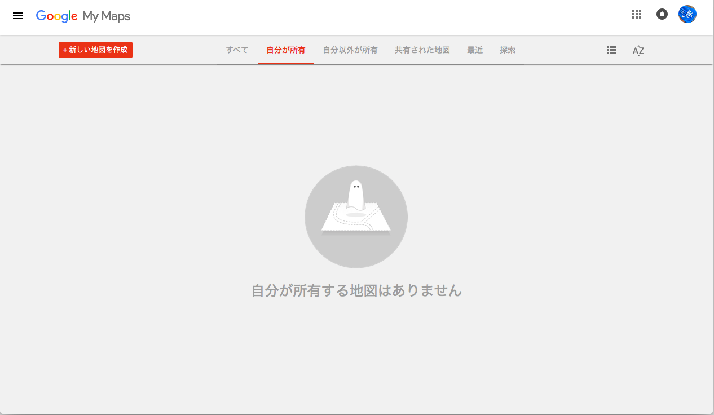
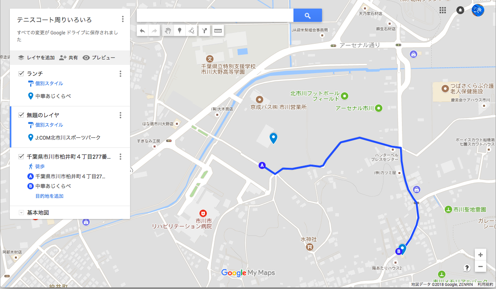

## 2017/07/06 Friday

今日の天気は雨、東京千葉はマシ。

北海道や九州なんかでは、記録的な大雨が降っている。災害。

無事を祈るばかり。

今日はQiitaで見た [10分で作れる社員用ランチマップを紹介したい](https://qiita.com/kyogom/items/720a8c5023900b8e9b1f?utm_source=Qiitaニュース&utm_campaign=950cbc682c-Qiita_newsletter_318_07_04_2018&utm_medium=email&utm_term=0_e44feaa081-950cbc682c-34077345) を実践してみようと思う。

プログラマじゃないけれど、プログラムを書いたり、Hackできたりするようになりたいので、週末はちょこちょこやっていきたい。

テニスの回数を減らそうかな・・・。

恥ずかしながら、[マイマップ](https://www.google.co.jp/intl/ja/maps/about/mymaps/)って機能があることを初めて知った。

「利用を開始」をポチッとな。

自分が所有する地図はありません・・・って。

そりゃさっきまで存在知らなかったんだもの、あるわけないでしょーが。

「新しい地図を作成」をポチッとな。

地図タイトルを適当にセッティングして、レイヤを追加。

とりあえず、テニスコートとよく行く中華屋さん、ルートを追加した。

とりあえず保存してみた結果が、 [こちら](https://drive.google.com/open?id=14GXvYexWHC5s-tLBt64WEHnl_O2jkP-w&usp=sharing) になります。
