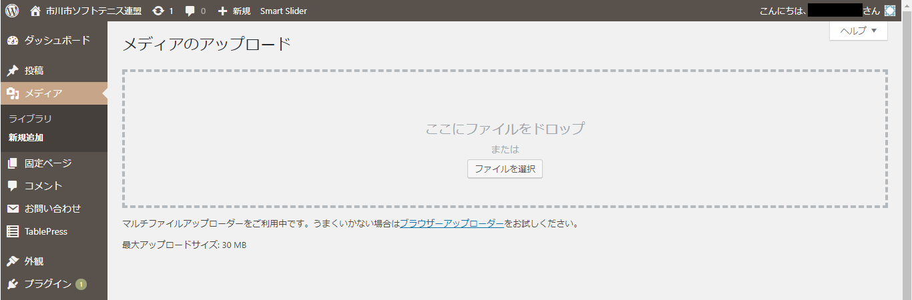
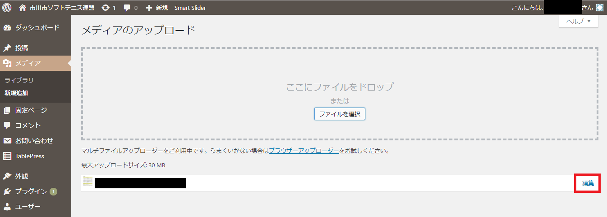
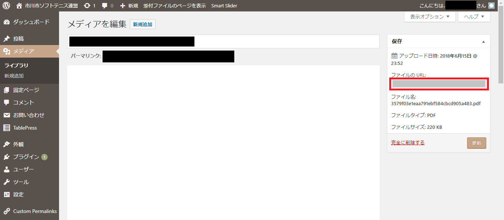
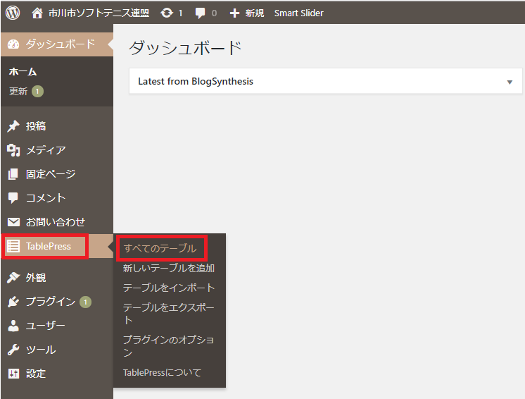
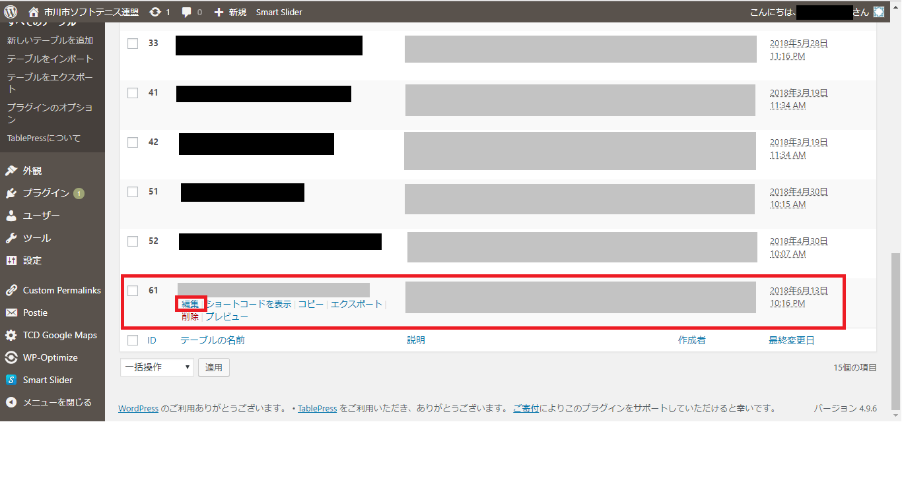
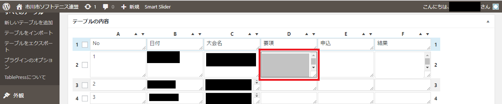
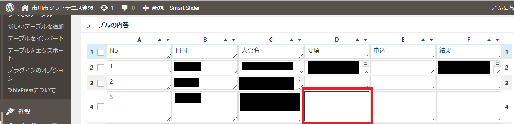
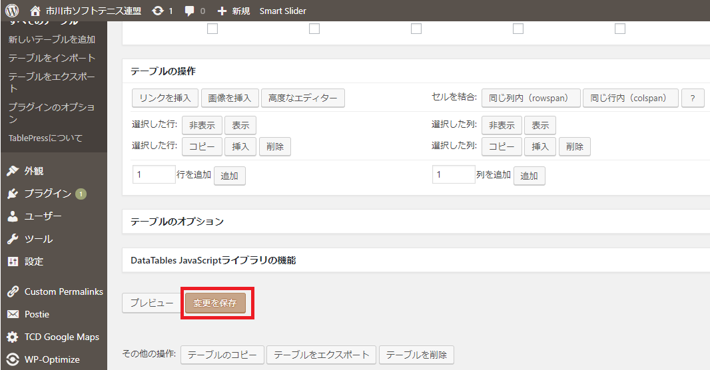
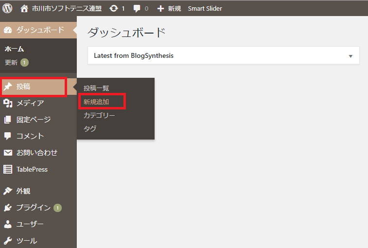
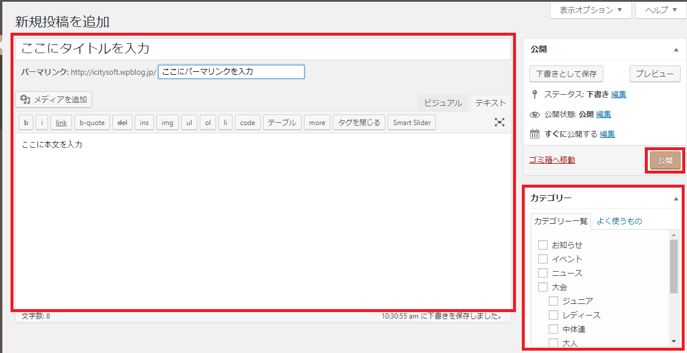

## How to post 1 ...

以下の通り、投稿をしてみてください。
ログインをするところは省略します。
 

### 大会の要項PDFをホームページにアップしてみよう！

<ol>
<li>左メニューから、「メディア」->「新規追加」を選択してください。</li>
 

   

<li>PDFデータを直接「ここにファイルをドロップ」枠にドロップするか、「ファイルを選択」ボタンを押してPDFデータを選ぶか、どちらかの方法でPDFデータをアップロードしてください。</li>
 

   

<li>アップロードした結果が、アップロード枠の下に表示されます。右側に「編集」ボタンがあるので押してください。</li>
 

   

<li>「メディアを編集」画面が開きます。右側の「ファイルのURL:」の下にURLがあるので、それを全てコピーします。（http〜.pdf）コピーしたURLをメモ帳などどこかに貼り付けておいてください。</li>
 

   

<li>左メニューから、「TablePress」->「すべてのテーブル」を選択してください。（「TablePress」を選択するだけで、勝手に「すべてのテーブル」が開く）</li>
 

   

<li>画面を下にスクロールしていって、対象のテーブルにカーソルを合わせると、テーブル名の下にメニューが表示されます。その中から「編集」を押してください。</li>
 

   

<li>赤枠で囲まれたところに記載されている内容をすべてコピーしてメモ帳などどこかに貼り付けてください。</li>
 

   

<li>上記7.でコピーした内容は以下の通りになっています。その中で「aaaaa.pdf」の部分を4.でコピーしたURLに置き換えます。その際、改行を一緒に持ってこないように気を付けてください。</li>
 

<code>

</code>

   

<li>上記8.で作成したすべてを入れたい枠にコピー&ペーストで貼り付けます。</li>
 

   

<li>画面を一番上か一番下にスクロールすると「変更を保存」ボタンがあるので押してください。</li>
 

   

<li>ホームページを開いて、想定した通りにPDFが開くか確認してみてください。</li>
</ol>

   
### 要項をアップしたことを投稿してみよう！

<ol>
<li>左メニューから、「投稿」->「新規投稿」を選択してください。</li>
 

   

<li>以下の通り入力してください。入力が完了したら、「公開」ボタンを押して投稿を公開してください。公開前に「プレビュー」ボタンを押して、投稿内容を確認することをお勧めします。 
<ul>
<li><b>タイトル：</b>「ここにタイトルを入力」と記載しているところにタイトルを入力してください。（ex. 大会要項掲載：市川オープンソフトテニス大会） </li>
<li><b>パーマリンク：</b>「ここにパーマリンクを入力」と記載しているところにパーマリンクを入力してください。パーマリンクとは、投稿のURLのことです。（ex. 20180617-requirements-ichikawa-open） </li>
<li><b>本文：</b>「ここに本文を入力」と記載しているところに本文を入力してください。内容は他の投稿を参考にしてください。「テキスト」よりも「ビジュアル」の方が見た目としてわかりやすいです。 </li>
<li><b>カテゴリー：</b>投稿前にカテゴリーを選択してください。カテゴリーは複数選択できます。大会要項をアップした時は、「お知らせ」「ニュース」「大会」「大人」「競技委員会」で良いと思います。しっくりくるカテゴリーがなければ新しく作成することもできます。 </li>
</ul></li>
 

   
</ol>
