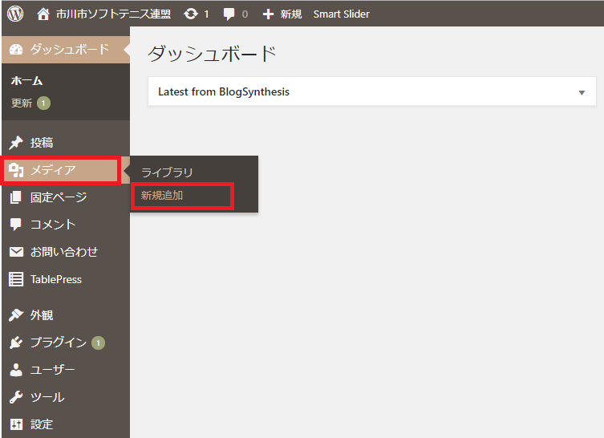

## How to post 1 ...

以下の通り、投稿をしてみてください。
ログインをするところは省略します。


### 大会の要項PDFをホームページにアップしてみよう！

1. 左メニューから、「メディア」->「新規追加」を選択してください。


2. PDFデータを直接「ここにファイルをドロップ」枠にドロップするか、「ファイルを選択」ボタンを押してPDFデータを選ぶか、どちらかの方法でPDFデータをアップロードしてください。


3. アップロードした結果が、アップロード枠の下に表示されます。右側に「編集」ボタンがあるので押してください。


4. 「メディアを編集」画面が開きます。右側の「ファイルのURL:」の下にURLがあるので、それを全てコピーします。（http〜.pdf）コピーしたURLをメモ帳などどこかに貼り付けておいてください。


5. 左メニューから、「TablePress」->「すべてのテーブル」を選択してください。（「TablePress」を選択するだけで、勝手に「すべてのテーブル」が開く）


6. 画面を下にスクロールしていって、対象のテーブルにカーソルを合わせると、テーブル名の下にメニューが表示されます。その中から「編集」を押してください。


7. 赤枠で囲まれたところに記載されている内容をすべてコピーしてメモ帳などどこかに貼り付けてください。


8. 上記7.でコピーした内容は以下の通りになっています。その中で「aaaaa.pdf」の部分を4.でコピーしたURLに置き換えます。その際、改行を一緒に持ってこないように気を付けてください。

```markdown
<center><a href="aaaaa.pdf" target="\_blank"></a></center>
```

9. 上記8.で作成したすべてを入れたい枠にコピー&ペーストで貼り付けます。

10. 画面を一番上か一番下にスクロールすると「変更を保存」ボタンがあるので押してください。

11. ホームページを開いて、想定した通りにPDFが開くか確認してみてください。
